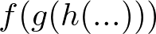

# Convol - functional convolution pkg writen in go.

## What is Convol
Convol implements functional convolution.
<div align="center">
  
</div>

## Why Convol ?
We offten writes early return with golang as following.

```go
func something() (err error) {
  err = DoFuncA()
  if err != nil {
    return err
  }

  err = DoFuncB()
  if err != nil {
    return err
  }

  ...
}
```

Too long function body reduces readability, but we should do it to ensure integrity.  
Convol supports multi-functionals convolution writing.

## Example
With Convol, you implement ConvolFunc as following.
```go
func handler(*convol.ConvolCtx) error {
	log.Println("handler")
	return fmt.Errorf("error occurred")
}
```

And Chain handlers.
```go
cnvl := convol.New()
cnvl.Add("handler1", handler_1)
cnvl.Add("handler2", handler_2)
cnvl.Add("handler3", handler_3)
```

Then build functions and run.
```go
cnvl.Build()
err := cnvl.Do()
fmt.Printf("err: %s\n", err)
cnvl.DumpAllStatus()
```

## Run Order
Convol runs functions in reverse order of adding.  
In this case, convol evaluate `g` first, then `f`.
```go
cnvl.Add("f", handler_f)
cnvl.Add("g", handler_g)
```

## Run Level
Now, Convol supports `StrictLevel` and `PermissiveLevel`.  
By default, Convol uses `StrictLevel` that cancels all later functions if err occured.  
If you want to run all functions regardless of errors, `PermissiveLevel` is good.

## Result Propagation
After evaluation of $g(x)$, $f(x)$ that run next can use result of $g(x)$.  
To use result of some function, you should use `Store` in `ConvolCtx`
```go
func g(ctx *ConvolCtx) error {
  ctx.Store["prod-g"] = "result of g"
  return nil
}

func f(ctx *ConvolCtx) error {
  gResult := ctx.Store["prod-g"]
  err := dosomething(gResult)
  return err
}
```

Then, add functions in reverse order of running.
```go
cnvl := convol.New()
cnvl.Add("f", f)
cnvl.Add("g", g)
cnvl.Build()
```
